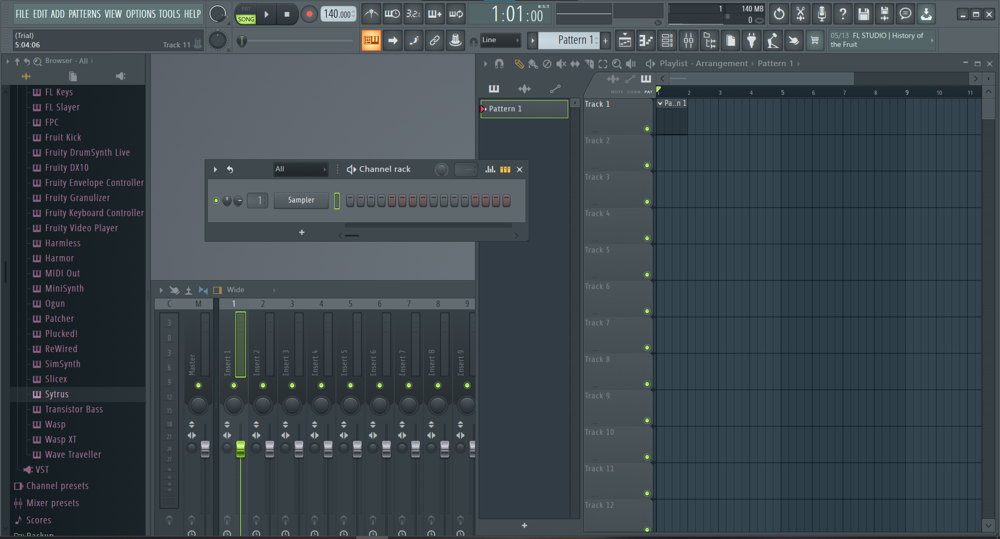
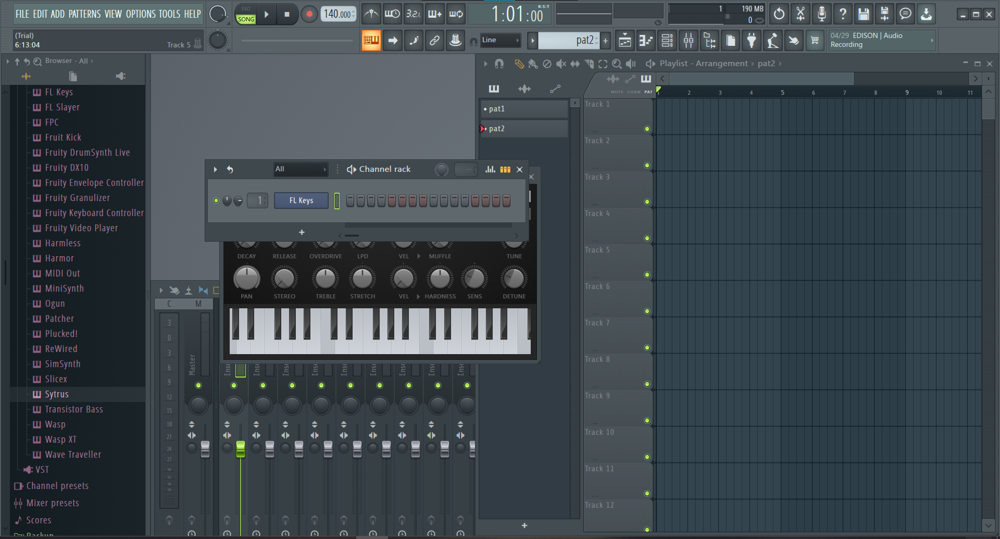
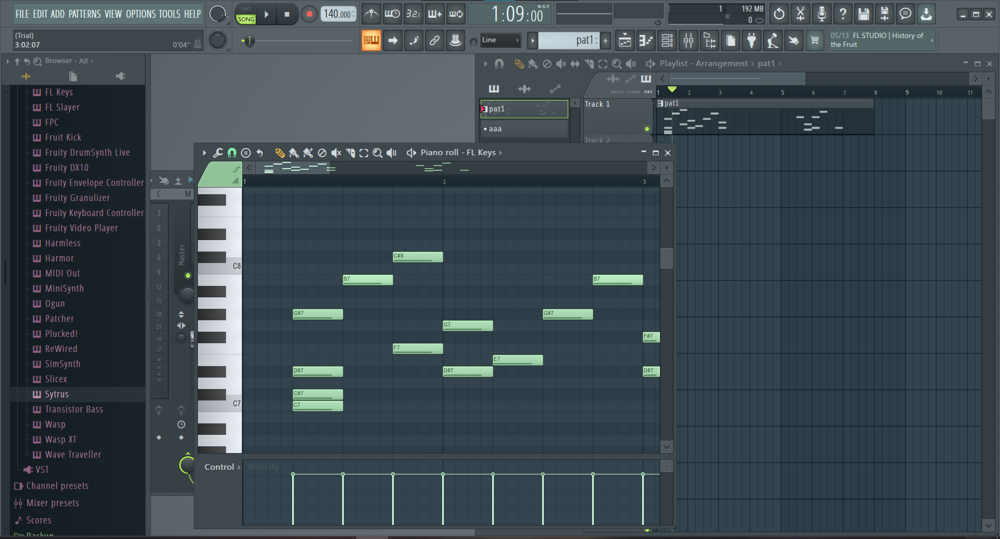
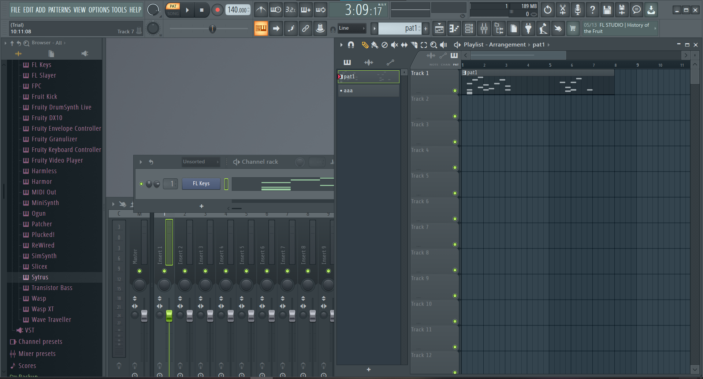

<!-- omit in toc -->
# CCS DTM講座'21 第1回
<!-- omit in toc -->
* [1.2 DAWに触れる](#12-dawに触れる)
	* [1.2.3 曲を書き出す前に](#123-曲を書き出す前に)
	* [1.2.4 曲を書き出す](#124-曲を書き出す)
## 1.2 DAWに触れる
FL Studioはかなり独特な操作性なので、鳴れるまでかなり苦労します。がんばりましょう。ざっくり専門用語込みで説明すると、「さまざまなパターンを張り付けて楽曲を完成させる」、です。詳しく見ていきましょう。

DAWを起動するといきなりいろいろデータがロードされてびっくりしますが、サンプル曲です。気になる人は聞いてみてください。
聴き終わったら、「FILE」→「New from template」→「Minimal」→「Empty」を選択してください。  
  
そうすると、まっさらになると思います。  
はじめに、チャンネルラックを表示させます。どこかをクリックしても開けますが、F6キーを押しても表示させられます。表示させると、  
  
のようになったと思います。この新しく現れたちっちゃい画面の下部に、「+」と書かれた部分があります。ここをクリックすると色々出てくるのですが、「Misc」というカテゴリーの下に「FL Keys」という楽器があるので、それを選択してください。元からあるSamplerに関しては、右クリックから開けるメニューで削除できるので、気に食わない人は削除して構いません。基本的に、このチャンネルラックに鳴らしたい楽器を全部入れてゆく形になります。 
  
この画像のようになりましたか？あと、「FL keys」の横に「-」と表示されている人はマウスホイールをその上でコロコロして、「1」と表示されるようにしておいてください。それができたら、「FL Keys」と書いてあるうえで右クリックして、「Piano Roll」をクリックしてください。ピアノロールが表示されました。長かったですね……。  
  
操作方法ですが、左クリックで音符を置いて、右クリックで消せます。範囲選択はctrl+ドラッグで行えます。32分以上を入力したかったり、三連符を入力したかったりする人は、ピアノロール上部にある磁石みたいなアイコンをクリックしていろいろ変更してみてください。それと、ピアノロール左上の三角ボタンからメニューを開き、「View」→「Key labels」→「All notes」に設定すると、全ての音階にキーを表示することができます。

打ち込みが終わったら、真ん中の行の「Pattern 1」の上でクリックして、その右の部分の「Track 1」と書いてあるところの1小節目をクリックしてください。
  
こんな感じに、音符が表示されたと思います。

ドラムの展開を変えたい！とか、メロディーを切り分けたい！とかなった場合は、画面真ん中にある「Pattern 1」とだけ書かれた謎の行があるのですが、その下にある「+」をクリックして、名前を付けると新しいパターンが作成されます。「Channel rack」と書いてある真上でマウスをコロコロしたり、秒数が書いてある部分の右下にある、「Pattern 1」などと表示されているところをクリックすることによってパターンを変更できます。打ち込みを始める前に、正しいパターンに対して操作を行っていることを確認したほうがいいです。

音が鳴らないときは、再生する対象がSONGになっているか、PAT(patternの略ですね)になっているかを確認してみてください。BPMの横に書いてあります。
### 1.2.3 曲を書き出す前に
F9キーを押すと、ミキサーが呼び出せます。  
  
これです。一番左にMasterって書いてある物があります。これはいじってはいけないやつです。その一つ右に「Insert 1」というのがあるので、これの音量をフェーダーで調整してください。「Insert n」のnは、ピアノロールを開く時の作業で、「-」の上でマウスをコロコロしたと思うのですが、ここの数字に関係しています。一種類の楽器に一つの数字を割り当てる、くらいの感覚でいいと思います。
### 1.2.4 曲を書き出す
これまでと打って変わって、曲の書き出しはかなり簡単です。左上から「FILE」→「Export」→「WAV File」を選択すると、どこに出力するかのウインドウが出てくるので、タイトルと場所を決めて出力してください。