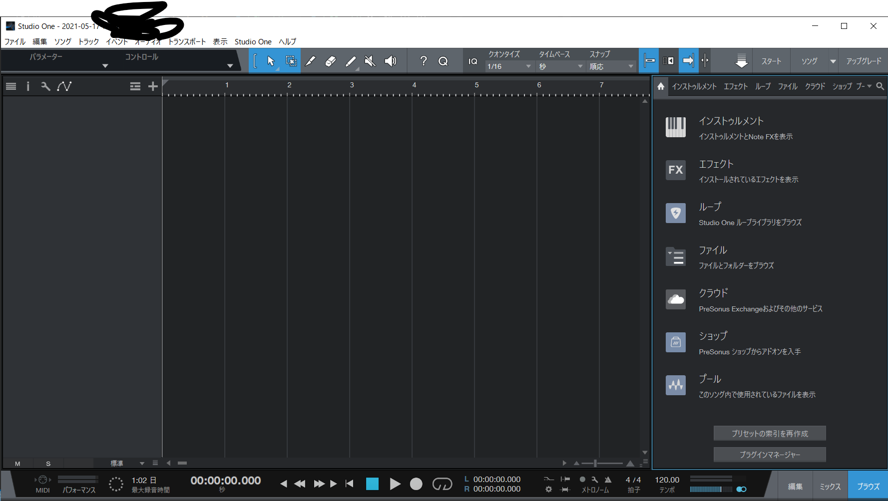
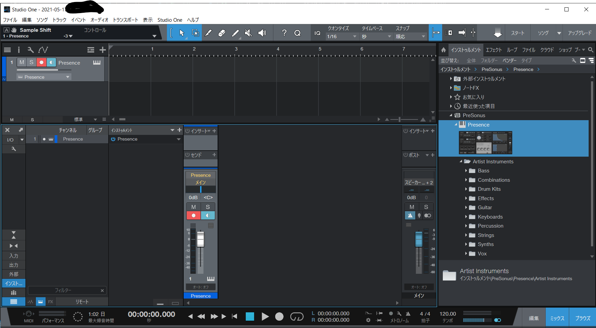
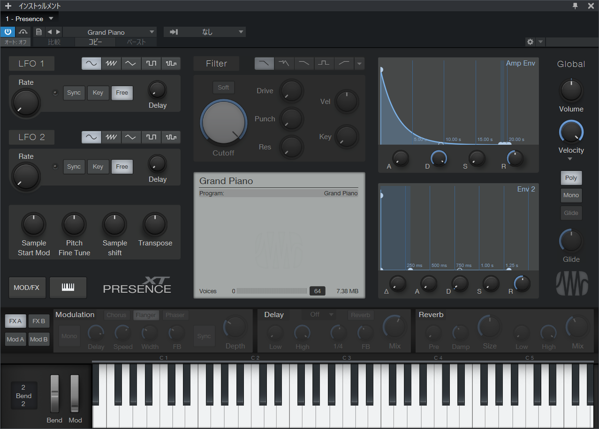
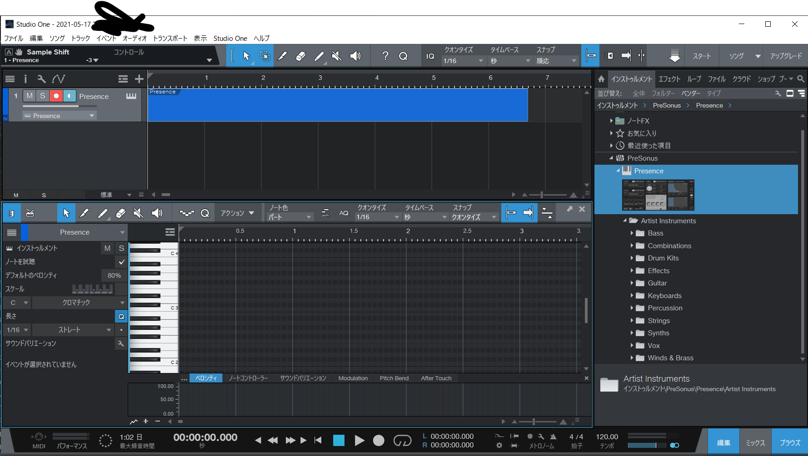

<!-- omit in toc -->
# CCS DTM講座'21 第1回
<!-- omit in toc -->
* [1.2 DAWに触れる](#12-dawに触れる)
	* [1.2.3 曲を書き出す前に](#123-曲を書き出す前に)
	* [1.2.4 曲を書き出す](#124-曲を書き出す)
## 1.2 DAWに触れる
DAWを起動すると、以下のような画面が表示されます。
  
「新規ソング」をクリックしたのち、設定は特に変えず、作成をクリックしてください。
  
この画面になったら、「インストゥルメント」→「Presonus」の順番でクリック。
そうするとピアノが映った画面が出てきます。閉じてしまった人は、
  
の画面で、「Presonus」と書いてある横にあるピアノっぽいアイコンをクリックしてもう一度開いてください。
  
の画面で、ちょうど「コピー」と書いてある上のボタンをクリックして、「Keyboards」→「Grand Piano」を選択してください。ピアノの音になります。
  
元の画面に戻ります。「Presence」と書いてある部分をクリックすると、その部分が青くなって、ピアノロールが開きます。開いたら、「スナップ」を「順応」に変更してください。16分音符より細かい音符や三連符を入力したい方は、適宜クォンタイズの値を変更してみてください。

### 1.2.3 曲を書き出す前に
フェーダーは、
  
の右下にある「ミックス」をクリックして青くすると出てきます。いじってはいけないのはMainですね。

### 1.2.4 曲を書き出す
小節数の書いてあるところを、左端から曲が終わる一小節後くらいまでドラッグしてください。これでループが設定されるので、左上の「ソング」→「ミックスダウンをエクスポート」をクリックしてください。その後は何もいじらずにOKを押すと、設定した場所に曲が書き出されます。