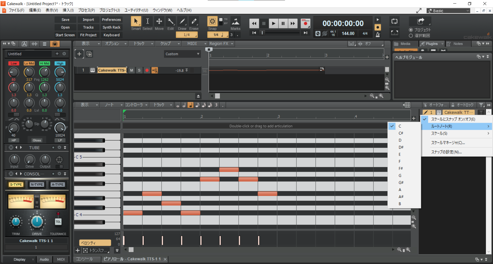

<!-- omit in toc -->
# CCS DTM講座'21 第2回
<!-- omit in toc -->
## 目次
* [2.1 音楽理論基礎1(スケール)](#21-音楽理論基礎1スケール)
	* [2.1.1 音名を結びつける](#211-音名を結びつける)
	* [2.1.2 音符の様々な表し方](#212-音符の様々な表し方)
	* [2.1.3 ペンタトニックスケール](#213-ペンタトニックスケール)
* [2.2 メロディ作成](#22-メロディ作成)
	* [2.2.1 下準備](#221-下準備)
	* [2.2.2 メロディを作る](#222-メロディを作る)
	* [2.2.3 いいメロディのために](#223-いいメロディのために)
* [2.3 今日やった大事なこと(覚えてね！)](#23-今日やった大事なこと覚えてね)
* [2.4 おわりに](#24-おわりに)
* [2.5 参考にした資料](#25-参考にした資料)

## 2.1 音楽理論基礎1(スケール)
世の中の音楽というのは、大体7音(とそのオクターブ違い)からなっています。前回のデータが開ける人は開いて確認してみましょう。  
前回の曲はロ短調、B-minor(もしかしたらニ長調、D-majorかも)という調なのですが、この調には、「シ、ド♯、レ、ミ、ファ♯、ソ、ラ(、シ)」が含まれています。この順番に鍵盤を叩いてみると、なんとなんだか物悲しい(短調なので)「ドレミファソラシド」が聞こえてきます。実は、どの鍵盤から始めても、「ドレミファソラシド」っぽく聞こえるようにできます。日常によくある例でいうと、カラオケでキーを変えても問題なく歌えることと同じです。

### 2.1.1 音名を結びつける
| イタリア | ド   | レ   | ミ   | ファ | ソ   | ラ   | シ   |
| :------- | :--- | :--- | :--- | :--- | :--- | :--- | :--- |
| 英米     | C    | D    | E    | F    | G    | A    | B    |
| 日本     | ハ   | ニ   | ホ   | ヘ   | ト   | イ   | ロ   |

イタリアはドから始めているんですけど、それ以外の国ではなんかラを基準にしちゃったらしいですね。イタリア式の表記は知っていると思うので、英米式の表記をイタリア式のそれと結び付けましょう。日本式の表記は調を表す時にしか使わないけど、調が分からないと結構困るので覚えたほうがいいです。(筆者は覚えていません……)逆に英米式はコードとかにも大活躍です。

### 2.1.2 音符の様々な表し方
少し前に、どこからでも「ドレミファソラシド」っぽい音が作れるという話をしました。そうすると、音名で指定するよりも、「その調の中で何番目の音」ということに注目してあげたほうが便利だということに気が付きます。(単に「ミ」と言われるよりも、「3番目」と言われたほうが汎用性が高いですよね)

このような理由から、調を決定する音(主音といいます。〇長調の〇のこと)から、音の低い順にI,II,III,...,VIIとローマ数字を振っていきます。これを**ディグリーネーム**といいます。日本語では一度、二度…、七度となります。(ディグリーってdegreeなので当たり前ですね)

五線譜が読めなくてもピアノロールを数えればどの音を指しているのかわかるという点でうれしいですが、もっぱらスケールやコード進行で使うことが大半です。

### 2.1.3 ペンタトニックスケール
ようやく本題、スケールの話です。スケールというのはざっくり言うと音階のことで、ふつうの楽曲はスケールの中にある音を使って作曲します。
メジャースケール(長調)とか、マイナースケール(短調)とか聞いたことがあるかもしれません。(詳しくは次回やります)

今回はC-メジャーペンタトニックスケールでメロディを作っていきましょう。メジャーペンタトニックスケールは、メジャースケール(いわゆる「ドレミファソラシド」)から四度と七度を抜いたスケールです。
日本語ではヨナ抜き音階と呼ばれたりします。  
ヨナ抜き音階は邦楽に非常に採用例が多く、たとえば『夏祭り』や『千本桜』、『恋愛サーキュレーション』などに使われています。一方民謡にも多く、有名どころだと『蛍の光』もそうです。   
(マイナーペンタトニックスケールももちろんあって、二度と六度を抜きます)

## 2.2 メロディ作成

### 2.2.1 下準備
以降Calkwalk向け説明です。FL向け説明は[ここ](2_FL.html)をクリックしてください。  Studio Oneは[ここ](2_SO.html)です。

Cakewalkは便利なので、スケール外の音を入力しないような設定ができます。前回と同様にTTS-1を追加し、ピアノロールを開きます。すると右側に謎のメニューがあります。

楽器を右クリックするとメニューが出てくるので、ルートノートをCに、スケールをMajor Pentatonicに設定したのち、スケールにスナップ オン/オフにチェック。これでスケール外の音を入力できなくできます。  
あと今のところあんまり関係ないですが、楽器の名前の横に書いてあるMはMute、SはSoloの略です。Mを選択するとその楽器がミュートされて、Sを選択するとSがついている楽器だけが鳴ります。

### 2.2.2 メロディを作る
実際に打ち込んでみましょう。本当に自由に、なんでもいいです。

### 2.2.3 いいメロディのために
メロディがぱっとしないなー、なんてことはよくあります(筆者もです)。ので、いくつかいい感じのメロディにするためのコツを紹介します。
* 音の長さにメリハリを持たせる  
どうしても4分音符や8分音符ばかり使ってしまいがちなのですが、適度に16分音符や休符を混ぜたり、白玉(長音のことを俗にこう呼びます)を混ぜて伸びを出してみたりするといい感じです。トリルとかもいいかもしれませんね。
* 音の高さにメリハリを持たせる  
1オクターブとか、五度くらいなら変えても大丈夫だと思います。
* (上級者向け)スケール外の音を使う  
常用するとなんか変になっちゃうので、アクセント程度に……

## 2.3 今日やった大事なこと(覚えてね！)
* 音名の結び付け
* ディグリーネーム

## 2.4 おわりに
初めての作曲、お疲れ様でした。楽しいと思ってくれたらうれしいです。あとはベースとドラムがあれば楽曲が完成するわけです。皆さんが想像していたよりかは大変ではないかもしれません。そんなことないかも。  
ところで、今回からは理論を学んでいくわけですが、理論はあくまで先人の遺産に過ぎません。これに則ればある程度いい感じに聞こえる、という程度のものであって、金科玉条などではないです。実際現代の音楽は理論から外れた部分を大なり小なり持っていたりもするので、あまり気にしすぎる必要はないです。そんなことを気にしている時間があったら曲を完成させるほうがいい、とか。

**なんと、今回は宿題があります。**  
この講座の第5回は作成した曲を発表する回です。今回学んだことをもとに、発表する曲(のサビにあたる部分)のメロディを考えておいてください。DAWにピアノ音源で打ち込んでおくと、いざ作り始めるときに役に立ちます。

## 2.5 参考にした資料
* [度数と音程](https://soundquest.jp/quest/prerequisite/interval-1/):説明について