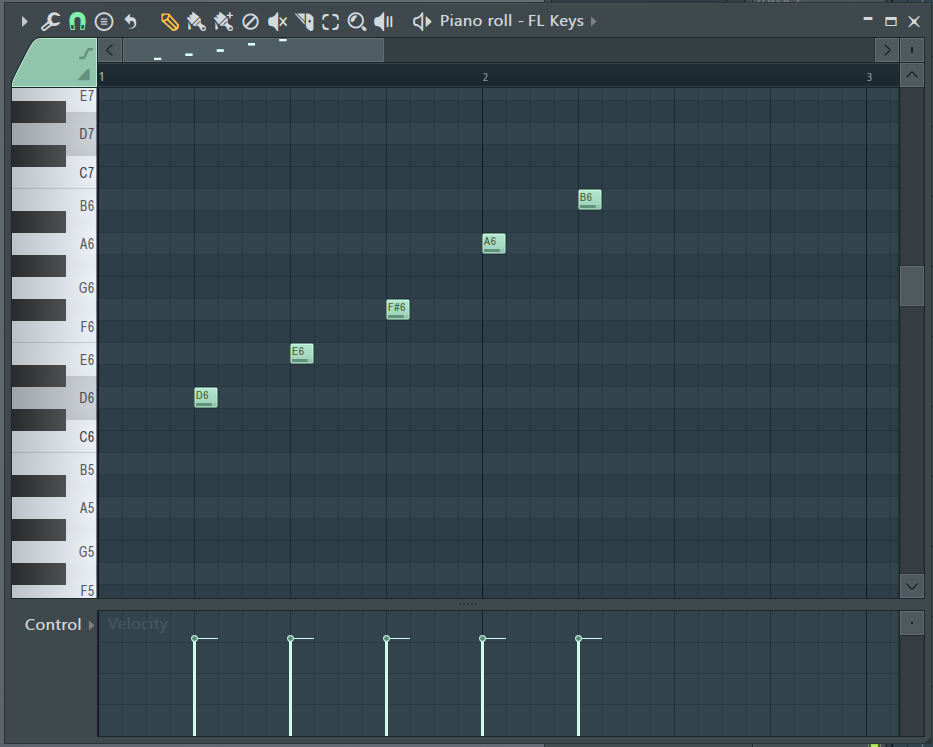

<!-- omit in toc -->
# CCS DTM講座'21 第1回
<!-- omit in toc -->
* [2.2.1 下準備](#221-下準備)
### 2.2.1 下準備
FLには残念ながらスケール外の音を入力しない設定はありませんが、その代わりにスケールをうっすらと表示してくれる機能はあります。ピアノロール左上の三角ボタンからメニューを開き、「View」→「Scale Highlighting」を選択したのち、キーとスケールを設定すると、スケール上の音がうっすら白みがかって表示されます(あんまり区別がつかないけど……)

よくわかんないですね。