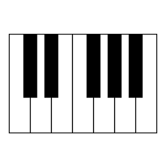
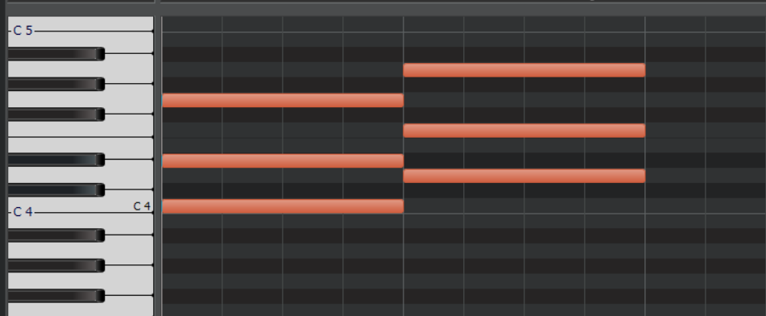

<!-- omit in toc -->
# CCS DTM講座'21 第3回
<!-- omit in toc -->
## 目次
* [3 音楽理論基礎2(スケール、キー、コード)](#3-音楽理論基礎2スケールキーコード)
* [3.1 スケール](#31-スケール)
* [3.2 キー](#32-キー)
* [3.3 コード](#33-コード)
	* [3.3.1 ダイアトニックコード](#331-ダイアトニックコード)
	* [3.3.2 トニックとドミナント、サブドミナント](#332-トニックとドミナントサブドミナント)
	* [3.3.3 よくあるコード進行](#333-よくあるコード進行)
* [3.4 ベース作成](#34-ベース作成)
	* [3.4.1 コード豆知識(詳しくは次回)](#341-コード豆知識詳しくは次回)
* [3.5 今日やった大事なこと(覚えてね！)](#35-今日やった大事なこと覚えてね)
* [3.6 おわりに](#36-おわりに)
* [3.7 参考にした資料](#37-参考にした資料)

## 3 音楽理論基礎2(スケール、キー、コード)
今回は前回のスケールの話を発展させて、キー、コードについても解説していきます。

## 3.1 スケール
前回から「メジャースケール」や「マイナースケール」などといった単語が定義もなく現れていました。今回はこれらの単語の説明をしましょう。
スケールというのは、ざっくり音階と説明しましたが、もう少し真面目に説明すると、音の間隔によって使う音を決める仕組みのことです。

用語を定義します。「半音」とは、隣り合った鍵盤の音の間隔を指します。「全音」とは、鍵盤を一つ飛ばして取ったときの音の間隔を指します。たとえば、ミとファは半音の関係です。ドとレは全音の関係です。(黒鍵も数えます)

出典: [アイキャッチャー](https://ai-catcher.com/)

「メジャースケール」というのは、主音から「全音、全音、半音、全音、全音、全音、半音」の間隔で音を取っていくスケールのことです。明るい感じの響きがします。さっきの鍵盤でC-メジャースケールを確認すると、確かに白鍵しか使っていません。  
「マイナースケール」というのは、主音から「全音、半音、全音、全音、半音、全音、全音」と音を取っていくスケールのことです。暗い感じの響きがします。  
この二つは違うようでよく似ている、というのが次の話題です。(ちなみに、全部全音の間隔で音を取るホールトーンスケールや、全部半音の間隔で取る(=要するに全部の鍵盤を使う！)クロマティックスケールというのもあります。)

## 3.2 キー
さて、前回はちょっとだけ調の話をしました。
前回の記事の中で、筆者は『亡き王女の為のセプテット』についてこのような言及をしました。
> 前回の曲(編注、セプテットのことです)はロ短調、B-minor(もしかしたらニ長調、D-majorかも)という調なのですが

ロ短調で使う音階を書き出してみます。ロは「シ」の音を指していて、ドとファの部分に♯がついていましたから、「シ、ド♯、レ、ミ、ファ♯、ソ、ラ」でした。  
ニ長調で使う音階も同様に書き出してみましょう。ニは「レ」の音を指していて、同様にドとファの部分に♯がついていましたから、「レ、ミ、ファ♯、ソ、ラ、シ、ド♯」ですね。  
二つの音階を見比べてみましょう。なんと使われている音が完全に一致します！では我々はどのようにしてロ短調とニ長調を区別しているのでしょう？答えは、「**感覚**」です。明るいなーと思ったら長調だと思うし、暗いなーと思ったら短調だと思います。長調と短調の境目は非常に曖昧なのです。

実は、一つ長調を選ぶと、それに対応する短調(短三度下の音が主音になります。短三度というのはざっくり、鍵盤3つ下がったところです。今度説明するかも)が必ず存在します。そして、その調の関係性をレラティブ(relative)と呼びます。

## 3.3 コード
コードは結構有名なので、名前を聞いたことくらいはあるかもしれません。カノンコード、とか。  
コードというのは、日本語だと「和音」といいます。かなりざっくり言うと、「特定の決まりにのっとって鍵盤を同時に押すときれいな音が鳴る」ということです。「特定の決まりにのっとって」というのが大事で、適当に押すと汚い音が鳴って、なんとなく精神が不安になりそうな感じがします。(不協和音ってやつですね)

今日は三和音(英語ではトライアド、です)をやるのですが、何はともあれ鳴らしてみましょう。
DAWを起動して、ピアノロールで画像のように入力してみましょう。

再生ボタンを押すと……どうでしょう、きれいで明るい感じの音が鳴りましたね。これらはどちらも「メジャーコード」に属しています。名前はそれぞれCmaj(C-メジャーと読みます)、Dmaj(D-メジャーと読みます)です。majを略して単にC,Dと書かれることもあります。

構成音を見てみましょう。一番下の音(ルートと言います)を基準に半音の単位で、**1番目、5番目、8番目**にある音が使われていますね。DAWにコードを打ち込むうえで今日一番重要なのはここです。ここだけでも覚えてください。ディグリーネームで言うと、I,III,Vが使われています。(ドミソ、ですね)  
メジャーコードであることさえわかれば音の間隔は先述したとおりに定まるので、文字としてはルート音だけ書けば和音が一意に定まるわけです。便利！

次はマイナーコードです。今度はこんな感じに。

要するに二番目の音を半音下げてあげるわけです。再生ボタンを押すと、なんだか物悲しい感じの音が鳴りましたね。これらがマイナーコード(の一部)です。名前はそれぞれCm(C-マイナー)、Dm(D-マイナー)です。

構成音は先述したように、ルートを基準に半音の単位で、**1番目、4番目、8番目**にある音が使われています。
(ディミニッシュコードとかいうのもあるんですけど、気になる人は調べてみてください)

### 3.3.1 ダイアトニックコード
ダイアトニックコードというのは、スケール内の音だけで作れるコードのことです。以降、ディグリーネームで表記しているときはダイアトニックコードの話だと思ってください。

### 3.3.2 トニックとドミナント、サブドミナント

コードは安定した響きの「トニック」、不安定な響きをした「ドミナント」、中間的な「サブドミナント」の三種類に分けられます。以下、それぞれの解説です。
* トニック  
Iのコード。安定感があって、フレーズを終わらせるときに使えます。似ている雰囲気のコード(代理コード)に、IIIとVIがあります。
* ドミナント  
Vのコード。不安定で、トニック(特にI)に繋がりやすい傾向です。代理コードはありません。(厳密に(？)いうとあります。VIIです。)
* サブドミナント
IVのコード。中間的なので、トニックにもドミナントにもつながります。代理コードはIIです。

さて、コード進行を考えるときに、トニックで終わらせればいいことが分かりました。実は始めるときもトニックで始めていいです。そうすると、ひとまとまりのコード進行として、
* トニック→ドミナント→トニック
* トニック→サブドミナント→トニック
* トニック→サブドミナント→ドミナント→トニック

が考えられますね。こんな感じのひとまとまりのことをカデンツと呼びます。3種類のカデンツを組み合わせて曲を作るわけです。(といっても、実際は一つのコード進行を最初から最後まで使いまわしてても全然問題ないです。)

### 3.3.3 よくあるコード進行 
前の節では、コード進行を自分で考える必要がある、みたいな言い方をしました。考えてもいいのですが、世間には先人の考えたいい感じのコード進行がありますから、これを借りて効率的にいい感じのコードを作りましょう。

* 王道進行:IV→V→IIIm→VIm  
J-POPによく使われているやつです。『[Can't take my eyes off you(君の瞳に恋してる)](https://www.youtube.com/watch?v=Cc1QzIWWIrc)』や、『[Don't say "lazy"](https://www.youtube.com/watch?v=5CSNv9MNEC4)』がそうです。
* カノン進行:I→V→VIm→IIIm→IV→I→V  
カノンです。これもJ-POPによく使われているやつです。『[さくら(独唱)](https://www.youtube.com/watch?v=p_2F2lKV9uA)』や、『[Dragon Night](https://www.youtube.com/watch?v=gsVGf1T2Hfs)』がそうです。
* 小室進行:VIm→IV→V→I  
小室哲哉さんが使ってたやつです。Get Wild。使用例は『[千本桜](https://www.youtube.com/watch?v=shs0rAiwsGQ)』などです。

これ以外にも結構無数にあるので、気になる人は検索してみたり、[ここ](https://trap.jp/post/562/)を読んでみたりしてください。[これ](https://www.youtube.com/watch?v=tE-b4nvusB8)も音が鳴るのでいいかもしれません。

## 3.4 ベース作成
お待たせしました。理論の話がかなり長かったと思いますが、重要なところでもあるので許してください……。

ここからは、ベースとメロディを作ってもらいます。今回は紹介した3種類の中から一つ進行を選んで、それをベースとしましょう。コツとして、コードとは別にルート音は1か2オクターブ下で鳴らしてあげると(左手でルート音を、右手でコードを、ということ)音に厚みが出ます。メロディは好きに打ち込んでください！気分の赴くままにポチポチしましょう。あと、**ベースとメロディのキーを合わせる**ことに注意してください。

### 3.4.1 コード豆知識(詳しくは次回)
コードは構成音が合ってさえいればいいので、たとえばCmajのGを1オクターブ下げたりしても響きがこわれません。これを転回といいます。音の上下が激しいときに転回してあげるといい感じになります。このように転回すると音符同士が離れるのですが、音程の開き具合をボイシングといいます。

## 3.5 今日やった大事なこと(覚えてね！)
* メジャー/マイナーコードの打ち込み方
* コード進行のルール
* 有名なコード進行

## 3.6 おわりに
おつかれさまでした。今回は本当に長かったですね。さて、今回の内容はかなり重要です。重要だけど、実際にDTMをしているときは「今日やった大事なこと」に掲載されていることくらいしか考えていません。ので、よくわかんないな～と思ったら最低限以外は忘れてしまってもさして問題はありません。気持ちいい感じに音を打ち込んでいったら、だいたいルールの範疇に収まっているので気に病むことはないです。

**今回も宿題があります。**  
発表会のために、ベース(コード進行)を考えておきましょう。既存のものでも全然おっけーです。気に入ったものを使っちゃいましょう！

## 3.7 参考にした資料
* [音階の仕組み ❶全音と半音](https://soundquest.jp/quest/prerequisite/scale-2/):説明について
* [音階の仕組み ❷段差にすべてを](https://soundquest.jp/quest/prerequisite/scale-3/):同上
* [調と調性](https://soundquest.jp/quest/prerequisite/key/):同上
* [作曲初心者が覚えておきたい定番コード進行パターン10選！](https://www.youtube.com/watch?v=WuWSyUhBcTo):有名進行の一例として