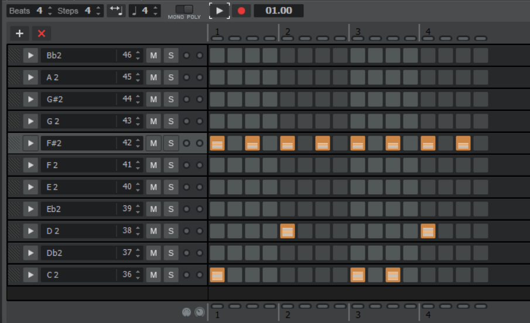
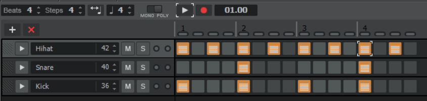
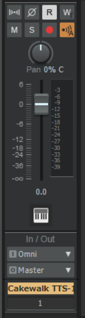

<!-- omit in toc -->
# CCS DTM講座'21 第4回
<!-- omit in toc -->
## 目次
* [4 音楽理論基礎3(その他)](#4-音楽理論基礎3その他)
* [4.1 セブンスコード](#41-セブンスコード)
	* [4.1.1 前準備](#411-前準備)
	* [4.1.2 セブンスコードのバリエーション](#412-セブンスコードのバリエーション)
* [4.2 ボイシングとコードの転回](#42-ボイシングとコードの転回)
	* [4.2.1 ボイシング](#421-ボイシング)
	* [4.2.2 コードの転回](#422-コードの転回)
* [4.3 リズム隊作成](#43-リズム隊作成)
	* [4.3.1 DAWの使い方](#431-dawの使い方)
	* [4.3.2 グルーヴ感を生み出す](#432-グルーヴ感を生み出す)
* [4.4 ミックス基礎1](#44-ミックス基礎1)
	* [4.4.1 パンニング](#441-パンニング)
	* [4.4.2 フェーダーワーク](#442-フェーダーワーク)
* [4.5 今日やった大事なこと(覚えてね！)](#45-今日やった大事なこと覚えてね)
* [4.6 おわりに](#46-おわりに)
* [4.7 参考にした資料](#47-参考にした資料)

## 4 音楽理論基礎3(その他)
ここでは前回やらなかったコードの続きをちょっとだけ説明します。(あんまり深入りするとそれだけで大変なことになってしまうので……)

## 4.1 セブンスコード
前回は三和音の話をしましたが、今回は四和音、とりわけセブンスコードの話をします。セブンスコードはとにかく**エモい**です。が、やや複雑でもあります。度数の話を思い出しながら読んでください。

### 4.1.1 前準備  

出典: [アイキャッチャー](https://ai-catcher.com/)  
これまでは〇度という言い方をしてきました。厳密には正しくないときもあって、そういう時には短〇度、長〇度などという呼び方をします。鍵盤で確認します。  
ドの三度上の音はミです。ミの三度上の音はソです。  
では、ドとミは鍵盤何個分(つまり、半音にして何個分)離れているでしょう？4つですね。では、ミとソは鍵盤何個分離れているでしょう？3つですね。同じ度数なのに、音の間隔が違います。これはちょっと困ってしまいますね。

混同を防ぐために、半音3つ離れた音のことを短三度、4つ離れた音のことを長三度と呼びます。n(n=2,3,5,7)度の音に対して、半音の間隔が小さいn度を短n度、大きいn度を長n度と呼びます。半音の間隔に直すと理解しやすいですが、時間はかかります。(他は完全m度、増/減m度などと呼びます。詳しくは調べてみてください)

### 4.1.2 セブンスコードのバリエーション
セブンスコードはその名の通り、セブンス(七度)の音を三和音に重ねて作ります。今述べた通り、七度の音には短七度、長七度の音があります。一方三和音も、短三度(4番目)を入れるか、長三度(5番目)を入れるかでマイナーかメジャーかに分かれます。よって、三度の長短と七度の長短で4種類のセブンスコードが生まれます。
各コードをピアノロールで紹介しておきます。

* メジャーセブンス  
一小節目の和音です。メジャーコード+長七度。
* セブンス(ドミナントセブンスともいいます)  
二小節目の和音です。メジャーコード+短七度。
* マイナーメジャーセブンス  
三小節目の和音です。マイナーコード+長七度。  
* マイナーセブンス  
四小節目の和音です。マイナーコード+短七度。

お分かりいただけたと思いますが、長七度を重ねると「メジャーセブンス」が、短七度を重ねると「セブンス」がコード名につきます。それぞれ略してΔ7、7などと書きます。

DTMで使う分には、ルート音から半音の基準で数えて、**1,4/5,8,11/12**番目の音を重ねればよいということだけ覚えておけば十分です。

## 4.2 ボイシングとコードの転回
前回の作曲前に、「コードはある音をオクターブ上げ下げしてもこわれない」という話をしました。今回は詳しくコードの転回の話をします。

### 4.2.1 ボイシング
コード進行を打ち込んでいくときに考慮しなければならない点として、「コード全体の音の上下の激しさ」があります。ベースはメロディの引き立て役なので、メロディを食ってしまうような激しい音の上下は好ましくありません。  
ですから、「コードは構成音さえ合っていれば問題なく聞こえる」という性質を使って、コードを構成する音をオクターブ単位で上下させていきます。コードにある音だったら、「全部の五度をオク下でも鳴らす」みたいなことをしてもいいです。(低音はあんまり詰めすぎても聞こえないんですけど……)

このようにして、コードを構成音ごとにばらばらに置いていくことをボイシングといいます。構成音が1オクターブに収まらないときはオープンボイシング、収まるときはクローズドボイシングといいます。  
オープンボイシングの和音からは柔らかい印象を、逆にクローズドボイシングの和音からは硬い印象を受けます。(というのが通説ですが、筆者はよくわかっていません)

### 4.2.2 コードの転回
転回の定義についてはかなり各サイトによって言っていることが違って困るんですけど、ここでは[SoundQuest](https://soundquest.jp/quest/chord/chord-mv3/slash-chord-1/)の言っていることを信じて説明します。  
まず、コードの転回はボイシングの一種です。「音(ここでは特に左手の音)の移動を滑らかにする」という目的も同じです。  
前回、「ルート音はオクターブを下げて鳴らすと厚みが出てよい」という話をしました。実はこのオクターブ下で鳴らす音は、ルート音以外も許されています。すなわち、「左手で弾く音はコードの構成音ならなんでもいい」というのが転回という言葉が意味するところなのです。

いろいろ書いてありますが、深く考えずに、「構成音の順番を入れ替える」ことを転回と呼んでいいと思います。

## 4.3 リズム隊作成
私たちは今まで、メロディ、ベースを作りました。あとはドラムがあればとりあえず曲として完成するはずです。最後の一息、がんばりましょう。

### 4.3.1 DAWの使い方
以降Calkwalk向け説明です。FL向け説明は[ここ](4_FL.html)をクリックしてください。  Studio Oneは[ここ](4_SO.html)です。

ドラムは「ある特定の音階の音を鳴らす」楽器ではないので、ふつうはピアノロールで打ち込んだりはしません。じゃあどうやって打ち込むのかというと、リズム隊専用の打ち込み画面があります。  
楽器にSI-Drumを選択。ピアノロールを表示する要領で選んでいくと、「ステップシーケンサ」というのが見つかると思います。クリック！

こんな感じの画面が開かれます。設定の説明をします。左上のBeatsは1ループの小節数を示しています。Stepsは1小節内の拍数を示しています。Stepsは4の倍数にしておくといいと思います。クリックで音が置けて、右クリックで削除できます。よくあるリズムパターンを例にとって、打ち込みの練習をしてみましょう。

* 4つ打ち  
ダンスミュージックによく使われているやつです。バスが4分の間隔で鳴って、2、4拍目にスネアが、裏打ちでハイハットが鳴ります。(行の名前は右クリックで変更できます。)

* 8ビート  
ポップスでめちゃめちゃ使われているやつです。バスとスネアは四つ打ちと同じですが、ハイハットが8分の間隔で鳴ります。これが名前の由来です。

* 16ビート  
これもポップスやロックでよく使われているやつです。バスとスネアは**基本的に**8ビートと同じで、ハイハットが16分の間隔で鳴ります。これが名前の由来です。

ところで、2小節の頭と4小節の頭にハイハットがありません。これは実際にドラムを叩くことを考えてみるとわかるのですが、16分の間隔でハイハットを叩くのには多くの場合両手が必要で、スネアを同時に叩けないからです。(もちろんテンポが遅い場合はその限りではありません。)

### 4.3.2 グルーヴ感を生み出す
今まで打ち込んだドラムはどうも機械的で、ノリが悪い感じがします。ちょっとしたアレンジで自然な感じにしてみましょう。

この画像を参考に、二点ほど紹介しておこうと思います。  
* 音量を調整する  
いつも一定の音量で音が鳴るのは不自然なので、行についている名前の左側の矢印をクリックして音量にばらつきを持たせます。特にハイハットはこの調整が重要です。基本的には、「(表拍の音量)>(裏拍の音量)」となるように調整しておけば大丈夫です。
*  キックのリズムをアレンジする  
これはやや応用的で、また生音系の音楽に対して有効です。電子音楽はふつうに四つ打ちしとけば大体何とかなります。具体的にと言われると困るんですが、聴いたことある感じにキックのリズムをいじるとよいです。16分のリズムで入れる(ダブルアクションとかいうみたいです)のが効きます。

## 4.4 ミックス基礎1
曲が完成！……と言いたいのですが、実はまだ完成ではありません。ミックスと呼ばれる作業で、楽器ごとの音のバランスや音色を微調整していきます。今回は最低限のミックス作業として、パンニングとフェーダーワークについて解説します。(EQやコンプで音をいじったりもします。詳しくはおまけ参照)CalkWalkのコンソールとにらめっこをする回です。下の画像のやつです。

### 4.4.1 パンニング
以降Calkwalk向け説明です。FL向け説明は[ここ](4_FL.html)をクリックしてください。  Studio Oneは[ここ](4_SO.html)です。

パンニングとは、楽器音が左から聞こえてくるか、右から聞こえてくるかを振り分ける作業のことをいいます。現在はPan 0%となっていると思うのですが、これは全ての楽器が中心で鳴っていることを意味します。つまり、中央で音がごちゃごちゃに鳴ってしまっているのです。全ての楽器の音を聴かせるために振り分けを行うわけです。Calkwalkではつまみを左右にひねって振り分けます。振り分けの方針は大まかに以下のようです。  
* 低音(キック、ベースなど)、メロディは中央近辺
* 高音(ハイハットやスネア)、は左右にバランスよく振る

この二つを意識しておけば、大きく外すことはありません。いろいろ試してみてください。(詳しくは「パンニング DTM」などで検索するといいです。)

### 4.4.2 フェーダーワーク
フェーダーワークとは、フェーダー(縦に動くつまみのことです)を使って音量のバランスを整える作業のことをいいます。一般に、同じようなフェーダーの位置でも、高音はうるさく、低音は聞こえにくいです。(モニター環境によるかもしれません。)これらに注意しながら、以下のような方針で音量を調整していきます。ミュートやソロ機能を活用してください。CalkwalkやStudio Oneならコンソールの上側にMとかSとか書いてあるボタンがあります。ミュートボタンは押したらその楽器が鳴りません。ソロボタンは押したらその楽器だけが鳴ります。複数に対してソロボタンを押すこともできます。(じゃあソロじゃないじゃん。)
* 重要な楽器から始める。キック→メロディ→その他……など
* キックはソロで-8.0db程度になるように調整。メロディも同じくらい。
* 同様にだんだん楽器を増やしていって、最終的に0.0dbを超えない程度に調整。

## 4.5 今日やった大事なこと(覚えてね！)
* セブンスコードの鳴らし方(1,4/5,8,11/12番目)
* コードの転回
* パンニングとフェーダーワークの方法

## 4.6 おわりに
おつかれさまでした。今回も長かったですね……(ごめんなさい)。例に漏れず、「今日やった大事なこと」だけ覚えておけば何とかなります。  
これだけのことを知っていれば、一応曲が作れます！ということで、宿題です。

発表会で出すためのオリジナル曲を**完成させて**ください。レギュレーションは以下のようです。
* 尺は90秒くらい～(音ゲー尺くらいでおっけーです。が、短かろうと完成させることが第一です)
* テンポ、拍子は自由
* 最低限(このページにあるくらい)のミックスをすること

第2回、3回で作ったメロディーなどは流用してもらって問題ありません。音源はKompleteが役に立つと思いますが、もちろん自分でシンセ(など)を探して使ってもよいです。わからないことがあったら講師の人にどしどし質問してください。それと、特定のジャンルの作り方が分からないときは「How to (ジャンル名)」などで検索するといい感じの記事や動画が出てくると思います。それでは、皆さんの楽曲が聴けるのを楽しみにしています。

## 4.7 参考にした資料
* [第3日 音程](https://jp.yamaha.com/services/music_pal/study/score/pitch/index.html):度数の説明について
* [【EDM】海外プロも使っているコードテクニック](https://www.youtube.com/watch?v=WuWSyUhBcTo):ボイシングの例として
* [誰でもわかるコード進行講座 part7「転回形の基本」](https://www.youtube.com/watch?v=WuWSyUhBcTo):転回系の説明について
* [誰でもわかるコード進行講座 part8「転回形の利用」](https://www.youtube.com/watch?v=WuWSyUhBcTo):上に同じ
* [【DTM】作曲初心者が最初に覚えておきたい定番ドラムパターン10選！](https://www.youtube.com/watch?v=WuWSyUhBcTo):有名ドラムパターンの一例として