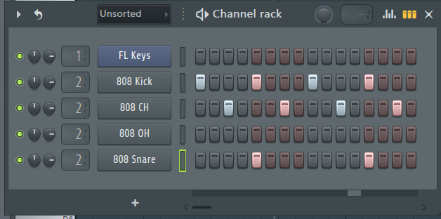
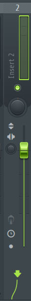

<!-- omit in toc -->
# CCS DTM講座'21 第4回
<!-- omit in toc -->
* [4.3.1 DAWの使い方](#431-dawの使い方)
* [4.4.1 パンニング](#441-パンニング)
* [4.4.2 フェーダーワーク](#442-フェーダーワーク)
### 4.3.1 DAWの使い方
ドラムについてですが、シンセサイザーを使う場合は、これまでのように楽器を追加したのち、ピアノロールから入力していけばよいです。  
サンプリング素材を使う場合は、素材をドラッグアンドドロップして、鳴らしたいタイミングに音を置くことで音を鳴らせます。詳しく説明します。  
左のBrowserから「Packs」を開きましょう。すると、たくさん出てきます。おのおのに「808 Kick」といったような名前がついていると思うのですが、これらはすべて.wavファイルです(恐らく)。これらのファイルをチャンネルラックにドラッグアンドドロップします。すると、その素材がラックに追加されました。以下の画像のようになると思います。(音符は置かれていないと思いますが)

1つのマークは16分音符一つに対応しています。クリックで置いて、右クリックで消せます。32分などにしたい方は、ピアノロールを開いて、C5のところにノーツが配置されているので、これをいじるといいと思います。  
  
音量はピアノロールを開かずとも、楽器名と音符を打ち込むスペースの間にある謎の棒をクリックして、その後ラック右上の音波のアイコンをクリックすることによって調整画面が現れるので、ここから調節できます。

チャンネルラックの楽器には二つつまみがついていますが、左側はパンニング、右側は音量です。普通は楽器でまとめて、ミキサーで処理するのですが、たとえばドラムセットを一つのインサートにまとめると、すべてのパンや音量が同時に調節されてしまって不便なので、ここで調整することもできます。(最初からインサートを分けてもいいと思います。)
### 4.4.1 パンニング
先述の通り、チャンネルラック上で同じインサート内のパンや音量調節を行った後、F9キーでミキサーを呼び出します。一つのインサートに着目します。  
  
フェーダーの上にあるつまみがパンのつまみです。つまみを回してパンニングします。
### 4.4.2 フェーダーワーク
ミュートやソロは実装されていますがやや特殊な方法で実現されます。パンのつまみの上にある緑色のランプを左クリックすると消灯します。これがミュートを示していて、もう一度左クリックすれば元に戻ります。ランプの上で右クリックするとソロになります。複数の楽器でソロにしたいときは、この状態から鳴らしたい楽器のランプを左クリックで点灯させてください。もう一度右クリックで元に戻ります。